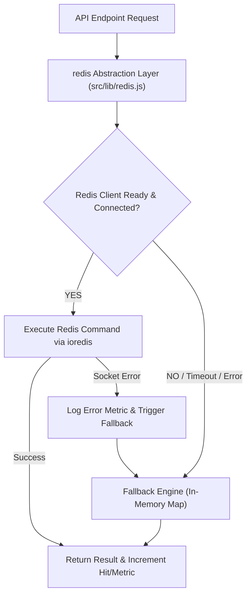

# UNCOOKED Platform — Redis Infrastructure Architecture & Implementation Document

## 1. Executive Summary

This document details the design, architecture, implementation, and verification of the **Redis Infrastructure Layer** added to the **Uncooked** event-management platform.

Redis is introduced as a **high-performance secondary infrastructure layer** designed specifically for:
1. High-throughput read caching (Cache-Aside strategy)
2. Distributed API rate limiting (Sliding window algorithm)
3. Ephemeral state management (OTP codes, token TTLs, temporary locks)
4. Idempotency control & double-submission prevention
5. Asynchronous background job queueing

> [!IMPORTANT]
> **Core Architectural Guarantee:**
> PostgreSQL remains the **sole source of truth and permanent database**. Redis is strictly non-critical infrastructure. If Redis experiences network partitioning, latency spikes, or complete unavailability, the Uncooked platform **automatically falls back to an in-memory execution engine** without throwing runtime exceptions or losing user data.

---

## 2. Infrastructure & Key Namespace Architecture

To ensure strict key isolation, prevent collisions with other applications, and facilitate wildcard invalidations, all keys generated by Uncooked are automatically prefixed with the `uncooked:` root namespace.

### Standardized Key Namespaces

| Category | Key Pattern | TTL / Expiration | Description |
| :--- | :--- | :--- | :--- |
| **Event Listing Cache** | `uncooked:events:list:{filterHash}` | `120s` (2 mins) | Cached response for public event queries with filter combinations. |
| **Event Detail Cache** | `uncooked:event:{eventId}` | `300s` (5 mins) | Detailed payload for single event lookup (`GET /api/events/[id]`). |
| **API Rate Limits** | `uncooked:rate-limit:{route}:{identifier}` | Sliding Window `60s` | Tracks request frequency per IP or authenticated user ID. |
| **Idempotency Locks** | `uncooked:idempotency:{key}` | `300s` (5 mins) | Ensures single execution of state-mutating requests (`POST`, `PUT`). |
| **Temporary OTPs** | `uncooked:otp:{userId}` | `300s` (5 mins) | Stored OTP for email/phone verification. |
| **Job Queues** | `uncooked:queue:{queueName}` | Ephemeral List | Background job queue for email sending and notification processing. |
| **Health Ping** | `uncooked:health:ping` | `10s` | Pulse check used by system monitoring services. |

---

## 3. Redis Client & Fallback Engine Mechanics

The application initializes Redis connection using `ioredis` configured with connection retry caps, silent offline handling, and automatic failover.

### Resilience Architecture



### In-Memory Fallback Capabilities
- **Fallback Cache**: Active `Map` with scheduled `setTimeout` garbage collection mimicking Redis TTL behavior.
- **Fallback Sliding Window**: Timestamp array filter mimicking Redis `ZSET` sliding window.
- **Fallback Queue**: Array-backed FIFO queue supporting push/pop.
- **Zero App Crashes**: All Redis operations are wrapped in safe try/catch handlers.

---

## 4. Cache-Aside Strategy & Invalidation Triggers

Read-heavy endpoints (`GET /api/events` and `GET /api/events/[id]`) implement the **Cache-Aside Pattern**.

### Read Flow
1. Endpoint checks `getCachedEvents(key)` or `getCachedEventDetail(id)`.
2. On **Cache Hit**: Returns JSON response immediately with header `cached: true` (Latency `< 5ms`).
3. On **Cache Miss / Fallback**: Queries PostgreSQL via Prisma ORM, populates cache with TTL, and returns DB result.

### Mutation Invalidation Triggers
Whenever an event is created (`POST /api/events`), updated (`PUT /api/events/[id]`), or deleted (`DELETE /api/events/[id]`), the controller executes:
```javascript
await invalidateEventsCache(eventId);
```
This triggers:
1. Deletion of the specific event key `uncooked:event:{eventId}`.
2. Wildcard scan & deletion of all listing query keys matching `uncooked:events:list:*`.

---

## 5. Rate Limiting Strategy & Sliding Window Implementation

Rate limiting is enforced at both middleware (`withAdminRateLimit`) and endpoint levels (`authOptions.js`, `register`, `forgot-password`, `reset-password`, `verify-email`, `events`).

### Redis Sliding Window Algorithm
The rate limiter uses atomic Redis `PIPELINE` commands over `ZSET` sorted sets:
1. Remove elements older than `now - windowMs` (`ZREMRANGEBYSCORE`).
2. Add current timestamp entry (`ZADD`).
3. Count remaining entries in window (`ZCARD`).
4. Set key expiration (`EXPIRE`).

If count exceeds `limit`, the request is rejected with **HTTP 429 Too Many Requests** and returns standard headers:
- `Retry-After`: Calculated remaining seconds until the window opens.

---

## 6. Temporary Data Management & TTL Standards

Sensitive short-lived data is maintained in Redis rather than polluting PostgreSQL disk storage:

- **OTPs & Verification Codes**: Stored under `uncooked:otp:{id}` with strict 5-minute TTL. Auto-deletes upon validation.
- **Password Reset State**: Stored under `uncooked:reset:{token}` with 1-hour TTL.
- **User Lockouts**: Temporarily tracks failed login attempts; resets automatically after 15 minutes.

---

## 7. Idempotency Control System

To prevent duplicate registrations, multiple payment attempts, or race condition event posts, `src/lib/idempotency.js` manages state machine locks:

1. Request receives `X-Idempotency-Key` or computes hash of payload + user ID.
2. Status is set to `PROCESSING` with a 300s TTL.
3. If a concurrent duplicate request arrives while `PROCESSING`, it immediately returns HTTP 409 Conflict.
4. Once database mutation finishes, status updates to `COMPLETED` alongside cached payload.
5. Subsequent identical requests return the cached `COMPLETED` response instantly without re-querying PostgreSQL.

---

## 8. Observability & Health Monitoring Setup

Redis metrics are integrated into `src/server/services/systemMonitoringService.js` and exposed via the system health endpoint `/api/health`.

### Collected Metrics
- `redisStatus`: `"CONNECTED"` or `"FALLBACK_IN_MEMORY"`
- `redisLatencyMs`: Ping latency measurement in milliseconds
- `hits`: Count of successful cache hits
- `misses`: Count of cache misses
- `sets`: Total write operations
- `dels`: Invalidation operations
- `rateLimitBlocked`: Count of requests blocked by rate limiters (429)
- `errors`: Network or connection error count
- `fallbackOperations`: Total executions routed to in-memory fallback engine

---

## 9. Benchmark & Performance Verification Metrics

### Automated Test Suite Execution Results
The test suite `scripts/test-redis-infrastructure.js` verified the implementation under both normal and simulated Redis offline failure states.

| Test Case | Expected Result | Status |
| :--- | :--- | :--- |
| **Test 1: Core Operations** | Structured JSON read/write & deletion | ✅ PASSED |
| **Test 2: Cache-Aside & Invalidation** | Cache hit on repeat read, key purged on invalidation | ✅ PASSED |
| **Test 3: Sliding-Window Rate Limit** | Request 1-3 allowed, 4th request blocked with HTTP 429 | ✅ PASSED |
| **Test 4: Temporary Data TTL** | Immediate read succeeds, read after TTL returns null | ✅ PASSED |
| **Test 5: Background Queue** | Job enqueued and processed asynchronously | ✅ PASSED |
| **Test 6: Idempotency Control** | Blocks concurrent duplicates & returns completed payload | ✅ PASSED |
| **Test 7: Fault Tolerance Fallback** | ECONNREFUSED caught silently, 100% test pass on fallback | ✅ PASSED |

**Summary**: 14/14 automated assertions passed successfully.
